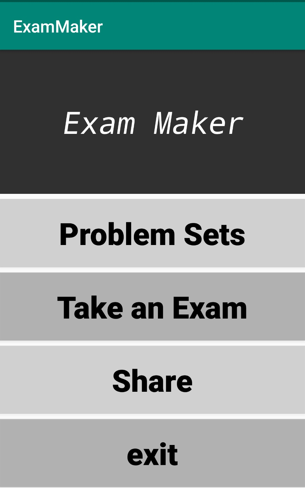
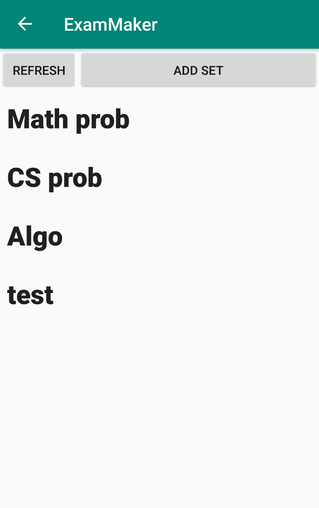
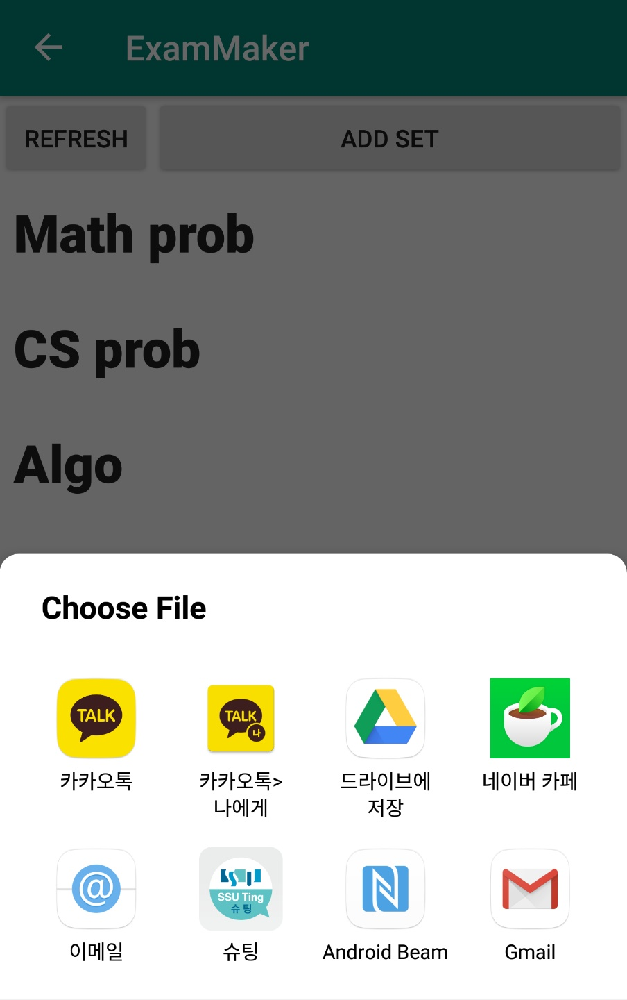

# ExamMaker  
Kotlin, Coroutine, MVVM, Room-Database  ,CSV Edit
  
## Function  
1. Make 'problem set'   
2. Take an exam in random order or in regular order  
3. Share 'problem set'   
  
  
## ScreenShots   
   

